前言：`app.json`文件不存在，有没有大佬有更好的解决办法？欢迎师傅们在评论区指点江山 :P

if -1 居然为 true，坑死我了 :(

# 注册账号

注册了之后没有地方注销，挺烦的。

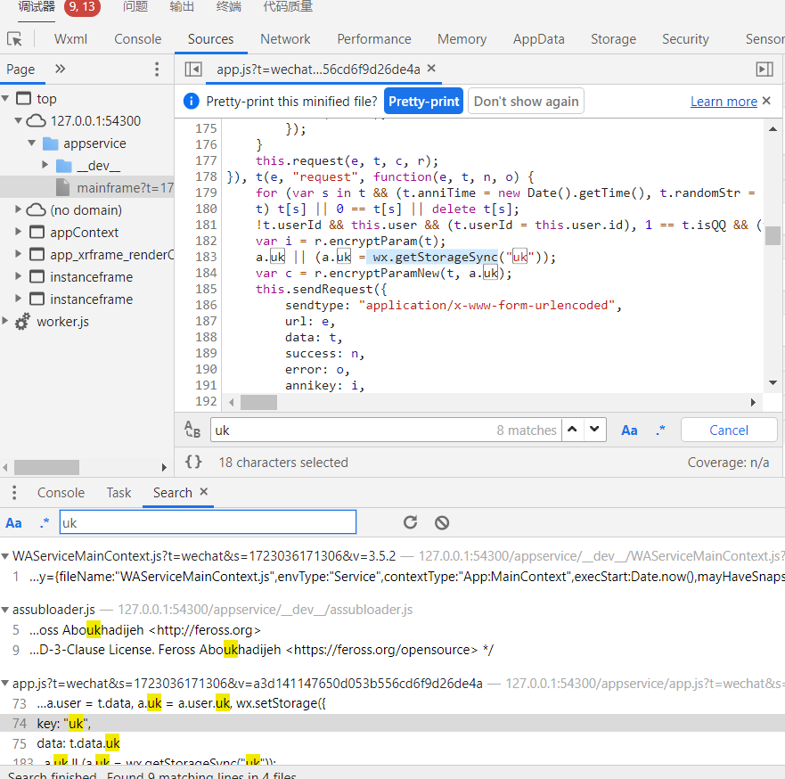

看来是从微信缓存里获取登录信息的。

也就是说，清除微信缓存就可以啦！


清除完后重新编译，就又需要登录了，方便调试。

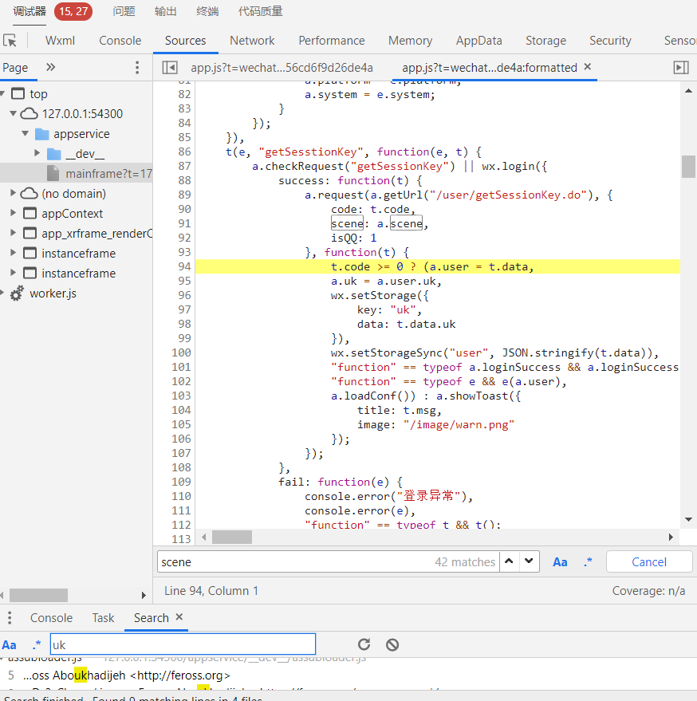

从`getSessionKey`里获取到`uk`。

触发注册接口，但是没有`getSessionKey`的包，只有`updateUserInfo`。猜测这个请求应该是在这之前完成的。

打断点，清除缓存，重新编译，果然断到了这里

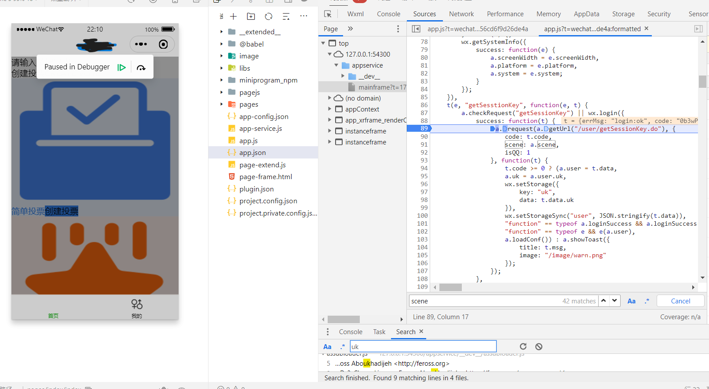

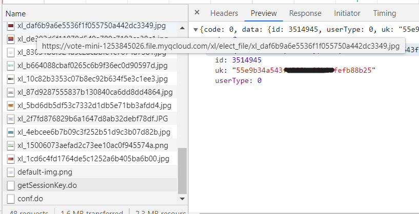

就是它了，有了它，我们就可以无限生成用户去投票了，桀桀桀桀桀桀桀桀桀桀桀（反派笑）

定睛一看，还有个code需要处理。

搜一搜这是什么，以下内容来自微信官方文档

> ## 功能描述
>
> 调用接口获取登录凭证（code）。通过凭证进而换取用户登录态信息，包括用户在当前小程序的唯一标识（openid）、微信开放平台账号下的唯一标识（unionid，若当前小程序已绑定到微信开放平台账号）及本次登录的会话密钥（session_key）等。用户数据的加解密通讯需要依赖会话密钥完成。

看来是开发者要考虑的事，如果想伪造应该可以试试这个方法 https://www.cnblogs.com/du-jun/p/12720945.html

我就懒得去弄了，直接发送请求试下

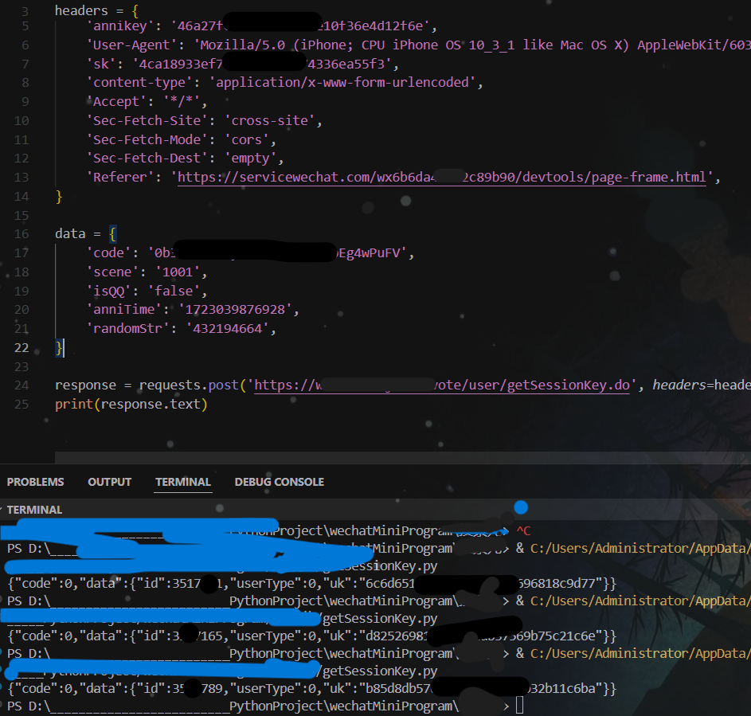

这个请求是复制curl的，我发现它请求头里居然有sk!

可是要获得sk不是要先向这个接口发送请求吗？

于是我猜测应该是什么缓存问题吧，于是把headers里的`annikey`和`sk`删掉，发现果然依旧可以获得数据


# 投票接口逆向

https://www.annikj.com/vote/elect/goVote.do

## `annikey`

不要在开发工具搜索，要在控制台那里搜，打断点也是！

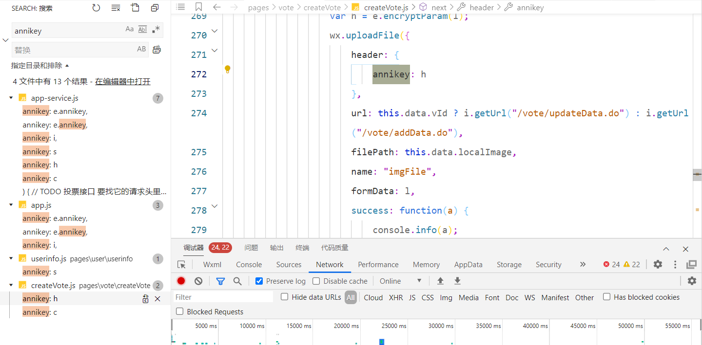

目测是md5。逆向过程略，太简单。抠出来运行的结果和前端对比下，是正确的！

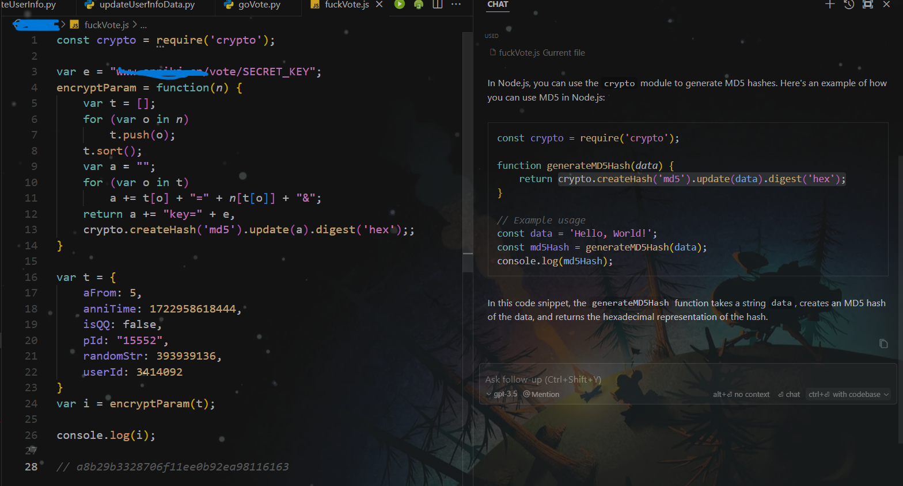

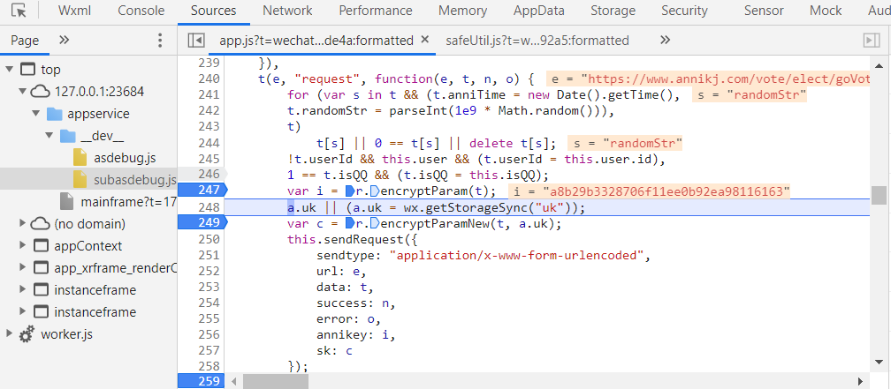

## `sk`

前面略，找到`uk`

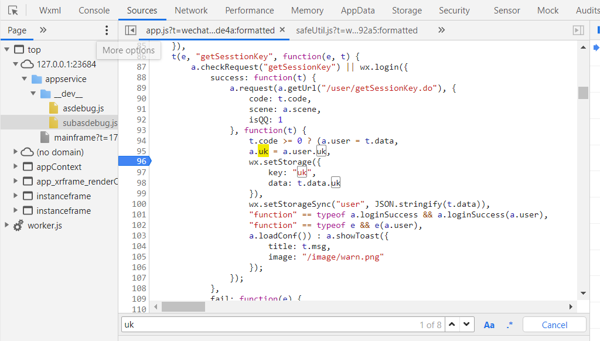

`uk`是从请求里获得的

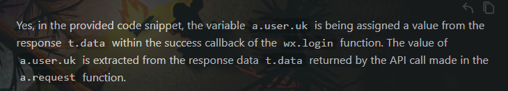

大概率是用户凭证一样的东西，一个用户一个样。

多投几次，在这里断下来，发现是定值，啊吧啊吧，固定下来就行。

update: 用注册账号的接口获取

## js->python

把js写成python也行的，或者用`execjs`

```python
def encrypt_param_new(e, n):
    t = list(e.keys())
    t.sort()
    a = ""
    for u in t:
        a += u + "=" + str(e[u]) + "&"
    if n:
        a += "key=" + n
    return hashlib.md5(a.encode()).hexdigest()


def encrypt_param(e):
    t = list(e.keys())
    t.sort()
    a = ""
    for u in t:
        a += u + "=" + str(e[u]) + "&"
    a += "key=" + "www.annikj.cn/vote/SECRET_KEY"
    return hashlib.md5(a.encode()).hexdigest()
```

# 微信开发者工具动态调试问题

## `app.json`不存在

手动创建，除了pages，其它人和代码有一个能跑就行。pages看报错，缺啥补啥

```json
{
  "pages":[
    "pages/index/index",
    "pages/user/user",
    "pages/elect/elect",
    "pages/elect/checkPlayer",
    "pages/elect/playerInfo/playerInfo",
    "pages/login/loginNew"
  ],
  "tabBar": {
    "list": [{
      "pagePath": "pages/index/index",
      "text": "首页",
      "iconPath": "image/home.png"
    },{
      "pagePath": "pages/user/user",
      "text":"我的",
      "iconPath": "image/sex.png"
    }]
  }

}
```

## 白屏

检查一下本地设置，把勾取消，把勾勾上

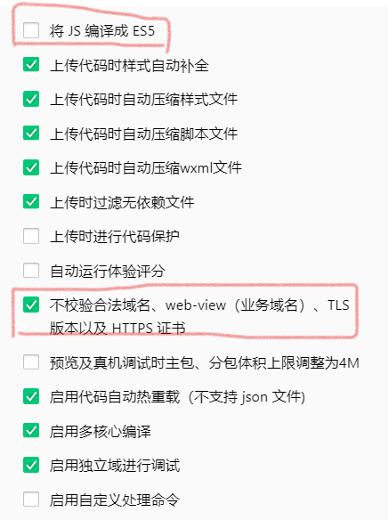


## 投票详情点不进去

在`pages`里添加相应页面

```json
  "pages":[
    "pages/index/index",
    "pages/user/user",
    "pages/elect/elect",
    "pages/elect/checkPlayer",
    "pages/elect/playerInfo/playerInfo",
    "pages/login/loginNew"
  ],
```

## 点不了同意

点了没反应，如果有大佬知道问题在哪，或者更方便的办法，欢迎在评论区指点 :D


搜关键词`同意并继续` 看是哪个坑爹玩意

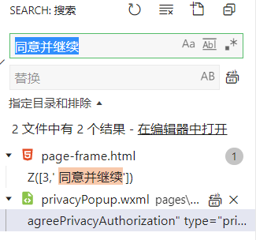

搜索`privacyPopup` ， 把`usingComponents`那行全删了

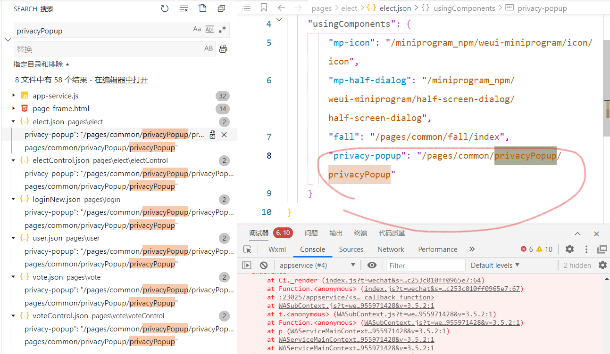

那几个js里的都要删

## 断点无效

要在控制台那里打断点

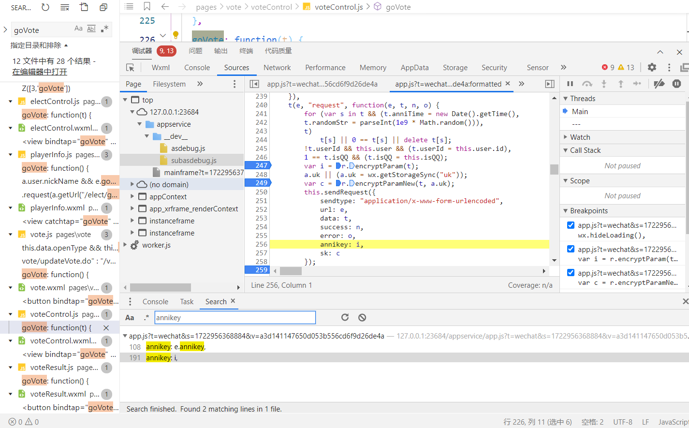


# 优化

## 上代理

略


## 数据库

新建的那么多用户，第二天想再次使用，不新建了。

数据库，启动！

```
net start mysql57
mysql -u root -p
6666
```

查看database

```sql
SHOW DATABASES;
```

使用 USE 命令选择你想查看的数据库

```sql
USE database_name;
```

要查看数据库中的所有表格，可以使用：
```sql
SHOW TABLES;
```

查看表格内容
```sql
SELECT * FROM user_data(表名)
```

To select all the `userId` values from your `user_data` table where `remain_votes` equals zero, you can use the following SQL command:

```sql
SELECT userId FROM user_data WHERE remain_votes = 0;
```

This command will retrieve all the `userId` entries from the `user_data` table where the `remain_votes` column is equal to zero.

To set `remain_votes` to zero for a specific `userId`, such as `'3587589'`, you can use the following SQL `UPDATE` command:

```sql
UPDATE user_data 
SET remain_votes = 0 
WHERE userId = '3587589';
```

This command updates the `remain_votes` column to `0` for the row where `userId` is `'3587589'`.


增加数据
```python
    try:
        result = cursor.execute(f"INSERT INTO user_data (userId, uk) VALUES ('{userId}', '{uk}')")
        conn.commit()
    except:
        print("数据写入失败")
        conn.rollback()
```

修改数据
```python
def user_vote_minus_one(userId):
    try:
        cursor.execute(f"UPDATE user_data SET remain_votes = remain_votes - 1 WHERE userId = '{userId}'")
        conn.commit()
    except:
        conn.rollback()
```

查看数据
```python
def read_data_from_database():
    cursor.execute("SELECT * FROM user_data")
    result = cursor.fetchone()
    # print(result)
    return result
```


## 多线程

票数差得太多，就用多线程追一下吧。。。

在多线程环境下操作数据库时，有几个注意事项需要考虑：

1. **数据库连接池**: 每个线程都应该有自己的数据库连接，而不是共享一个连接。使用数据库连接池可以更好地管理连接，避免连接泄漏和性能问题。

2. **事务管理**: 确保在操作数据库时使用事务来维护数据的一致性。在多线程环境下，确保每个线程的操作都在一个事务内完成，以避免数据不一致的情况发生。

3. **线程安全性**: 确保数据库操作是线程安全的。某些数据库操作可能不是线程安全的，需要特别注意并采取措施来保证线程安全。

4. **异常处理**: 在操作数据库时要注意异常处理。确保在发生异常时能够正确地回滚事务并释放资源，以避免数据损坏或资源泄漏。

5. **性能考虑**: 在设计多线程数据库操作时，要考虑数据库的性能。并发操作可能会导致数据库性能瓶颈，需要合理设计和调整线程数量。

遵循这些注意事项可以帮助确保在多线程环境下操作数据库时的数据完整性和性能。


没执行完任务就结束

在多线程环境中，主线程会等待所有子线程执行完毕后再结束。如果你的程序在主线程结束前就退出了，可能是因为子线程还在执行时主线程就已经结束了。这可能是由于主线程没有正确等待子线程完成的原因。
你可以在主线程中使用`executor.shutdown(wait=True)`来等待所有线程执行完毕后再结束主线程。这样可以确保所有任务都被执行完毕。


## 协程

这么快都不能满足你吗？别把服务器创死了 XD


## 白嫖服务器部署

### run:

```
!git clone https://github.com/teapot-4l8/voteUtil.git; cd voteUtil/; chmod +x EnvSetup.sh; ./EnvSetup.sh
```

开启终端
```bash
%load_ext colabxterm
%xterm
```

运行
```
python vote_reframe.py
```

更新
```
cd voteUtil
git remote update
```

每天执行一次刷新数据库
```
./exc_every_day.sh
```


以下是技术细节，非常好代码，爱来自chatgpt

To create a root user with a password and set up the MySQL environment in Google Colab, follow these steps:

### 1. Install MySQL Server on Google Colab
First, install MySQL server on your Colab environment:

```bash
!apt-get update
!apt-get install -y mysql-server
!service mysql start
```

### 2. Secure the MySQL Installation (Optional)
This step ensures that MySQL is secured by setting up a root password and disabling remote root logins:

```bash
!mysql_secure_installation
```

During this setup, you'll be asked to set a root password. You can set it to `'6666'` or whatever you prefer.

### 3. Set Up the Root User with Password `6666`
If you want to explicitly create or set the root password to `6666` using MySQL commands:

```bash
!mysql -e "ALTER USER 'root'@'localhost' IDENTIFIED WITH mysql_native_password BY '6666'; FLUSH PRIVILEGES;"
```

### 4. Create a Database and a Table
After setting up the root user, you can create the same environment as in your code snippet by creating a database and table.

1. **Log into MySQL:**

```bash
!mysql -uroot -p6666
```

2. **Create the Database:**

```sql
CREATE DATABASE dnfisreal;
```

3. **Use the Database:**

```sql
USE dnfisreal;
```

4. **Create the `user_data` Table:**

```sql
CREATE TABLE user_data (
    id INT AUTO_INCREMENT PRIMARY KEY,
    userId VARCHAR(255) NOT NULL,
    uk VARCHAR(255) NOT NULL,
    remain_votes INT DEFAULT 50
);
```

### 5. Populate the Table with Sample Data
You can insert some sample data into the `user_data` table:

```sql
INSERT INTO user_data (userId, uk, remain_votes) 
VALUES 
('3587589', 'exampleUK1', 50),
('1234567', 'exampleUK2', 0),
('7654321', 'exampleUK3', 50);
```

### 6. Verify the Environment
You can now verify that the environment is set up correctly by querying the data:

```sql
SELECT * FROM user_data;
```

### 7. Connect MySQL to Your Python Code
Finally, ensure that your Python code in Colab is connected to MySQL using the same credentials:

```python
import pymysql

DB_CONFIG = {
    'host': '127.0.0.1',
    'port': 3306,
    'user': 'root',
    'passwd': '6666',
    'db': 'dnfisreal'
}

conn = pymysql.connect(**DB_CONFIG)
cursor = conn.cursor()
cursor.execute("SELECT * FROM user_data")
results = cursor.fetchall()
print(results)

cursor.close()
conn.close()
```

By following these steps, you should be able to replicate the MySQL environment as described in your code snippet on Google Colab.


Importing and exporting MySQL data conveniently from the terminal can be done using MySQL's built-in tools. Here’s how you can perform these operations:

### Exporting Data

To export data from MySQL to a file (for backup or sharing), you can use the `mysqldump` command.

#### 1. **Export a Single Table**

To export a single table to a file:

```bash
mysqldump -u root -p6666 dnfisreal user_data > dnfisreal_backup.sql
```

- `-u root`: Username for MySQL.
- `-p6666`: Password for MySQL.
- `dnfisreal`: Database name.
- `user_data`: Table name.
- `user_data_backup.sql`: Output file.

#### 2. **Export the Entire Database**

To export the entire database:

```bash
mysqldump -u root -p6666 dnfisreal > dnfisreal_backup.sql
```

### Importing Data

To import data from a file into MySQL:

#### 1. **Import a SQL File**

To import data from a SQL file:

```bash
mysql -u root -p6666 dnfisreal < dnfisreal_backup.sql
```

- `-u root`: Username for MySQL.
- `-p6666`: Password for MySQL.
- `dnfisreal`: Database name.
- `user_data_backup.sql`: SQL file to import.

#### 2. **Import Data from CSV**

To import data from a CSV file, follow these steps:

1. **Prepare the Table**: Ensure the table is set up correctly in MySQL.

2. **Use the `LOAD DATA` Command**: Use the `LOAD DATA INFILE` command to import the CSV data.

   ```sql
   LOAD DATA INFILE '/path/to/user_data.csv'
   INTO TABLE user_data
   FIELDS TERMINATED BY ','
   ENCLOSED BY '"'
   LINES TERMINATED BY '\n'
   IGNORE 1 ROWS;
   ```

   - `/path/to/user_data.csv`: Path to your CSV file.
   - `FIELDS TERMINATED BY ','`: Indicates that fields in the CSV are separated by commas.
   - `ENCLOSED BY '"'`: Specifies that fields may be enclosed in double quotes.
   - `LINES TERMINATED BY '\n'`: Specifies the line termination character.

### Tips

- **File Permissions**: Ensure that the MySQL server has read permissions for the files you're importing.
- **File Path**: For `LOAD DATA INFILE`, the file path should be accessible from the MySQL server's file system.

### Example Workflow

**Export Data:**

```bash
mysqldump -u root -p6666 dnfisreal user_data > /tmp/user_data_backup.sql
```

**View Exported Data:**

```bash
cat /tmp/user_data_backup.sql
```

**Import Data:**

```bash
mysql -u root -p6666 dnfisreal < /tmp/user_data_backup.sql
```

This process allows you to easily manage and transfer data between MySQL databases and files using the terminal.

### bash script

```bash
#!/bin/bash

# Variables
DB_USER="root"
DB_PASS="6666"
DB_NAME="dnfisreal"
BACKUP_FILE="dnfisreal_backup.sql"

# Install pymysql using pip
pip install pymysql

# Install MySQL server
apt-get -y install mysql-server

# Start MySQL service
service mysql start

# Change MySQL root user password and flush privileges
mysql -e "ALTER USER '$DB_USER'@'localhost' IDENTIFIED WITH mysql_native_password BY '$DB_PASS'; FLUSH PRIVILEGES;"

# Create a new database
mysql -u$DB_USER -p$DB_PASS -e "CREATE DATABASE $DB_NAME;"

# Use the new database and import data from the backup file
mysql -u$DB_USER -p$DB_PASS $DB_NAME < $BACKUP_FILE

# Install colab-xterm using pip
pip install colab-xterm

# Print a message indicating completion
echo "All tasks completed successfully."

```

# 战绩

10个线程 10个用户 10票 2s

50票/s
