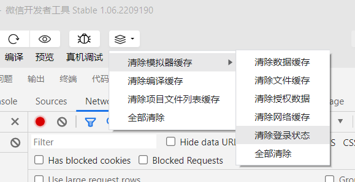

前言：`app.json`文件不存在，有没有大佬有更好的解决办法？欢迎师傅们在评论区指点江山 :P

# 注册账号

注册了之后没有地方注销，挺烦的。


看来是从微信缓存里获取登录信息的。

也就是说，清除微信缓存就可以啦！



清除完后重新编译，就又需要登录了，方便调试。


从`getSessionKey`里获取到`uk`。

触发注册接口，但是没有`getSessionKey`的包，只有`updateUserInfo`。猜测这个请求应该是在这之前完成的。

打断点，清除缓存，重新编译，果然断到了这里


就是它了，有了它，我们就可以无限生成用户去投票了，桀桀桀桀桀桀桀桀桀桀桀桀桀桀桀桀桀桀桀桀桀桀桀桀（反派笑）

定睛一看，还有个code需要处理。

搜一搜这是什么，以下内容来自微信官方文档

> ## 功能描述
>
> 调用接口获取登录凭证（code）。通过凭证进而换取用户登录态信息，包括用户在当前小程序的唯一标识（openid）、微信开放平台账号下的唯一标识（unionid，若当前小程序已绑定到微信开放平台账号）及本次登录的会话密钥（session_key）等。用户数据的加解密通讯需要依赖会话密钥完成。

看来是开发者要考虑的事，如果想伪造应该可以试试这个方法 https://www.cnblogs.com/du-jun/p/12720945.html

我就懒得去弄了，直接发送请求试下


这个请求是复制curl的，我发现它请求头里居然有sk!

可是要获得sk不是要先向这个接口发送请求吗？

于是我猜测应该是什么缓存问题吧，于是把headers里的`annikey`和`sk`删掉，发现果然依旧可以获得数据


# 投票接口逆向

https://www.annikj.com/vote/elect/goVote.do

## `annikey`

不要在开发工具搜索，要在控制台那里搜，打断点也是！


目测是md5。逆向过程略，太简单。抠出来运行的结果和前端对比下，是正确的！


## `sk`

前面略，找到`uk`


`uk`是从请求里获得的


大概率是用户凭证一样的东西，一个用户一个样。

多投几次，在这里断下来，发现是定值，啊吧啊吧，固定下来就行。

update: 用注册账号的接口获取

## js->python

把js写成python也行的，或者用`execjs`

```python
def encrypt_param_new(e, n):
    t = list(e.keys())
    t.sort()
    a = ""
    for u in t:
        a += u + "=" + str(e[u]) + "&"
    if n:
        a += "key=" + n
    return hashlib.md5(a.encode()).hexdigest()


def encrypt_param(e):
    t = list(e.keys())
    t.sort()
    a = ""
    for u in t:
        a += u + "=" + str(e[u]) + "&"
    a += "key=" + "www.annikj.cn/vote/SECRET_KEY"
    return hashlib.md5(a.encode()).hexdigest()
```


# 微信开发者工具动态调试问题

## `app.json`不存在

手动创建，除了pages，其它人和代码有一个能跑就行。pages看报错，缺啥补啥

```json
{
  "pages":[
    "pages/index/index",
    "pages/user/user",
    "pages/elect/elect",
    "pages/elect/checkPlayer",
    "pages/elect/playerInfo/playerInfo",
    "pages/login/loginNew"
  ],
  "tabBar": {
    "list": [{
      "pagePath": "pages/index/index",
      "text": "首页",
      "iconPath": "image/home.png"
    },{
      "pagePath": "pages/user/user",
      "text":"我的",
      "iconPath": "image/sex.png"
    }]
  }

}
```

## 白屏

检查一下本地设置，把勾取消，把勾勾上


## 投票详情点不进去

在`pages`里添加相应页面

```json
  "pages":[
    "pages/index/index",
    "pages/user/user",
    "pages/elect/elect",
    "pages/elect/checkPlayer",
    "pages/elect/playerInfo/playerInfo",
    "pages/login/loginNew"
  ],
```

## 点不了同意

点了没反应，如果有大佬知道问题在哪，或者更方便的办法，欢迎在评论区指点 :D


搜关键词`同意并继续` 看是哪个坑爹玩意


搜索`privacyPopup` ， 把`usingComponents`那行全删了


那几个js里的都要删

## 断点无效

要在控制台那里打断点


# 优化

## 上代理


## 多线程

票数差得太多，就用多线程追一下吧。。。


## 协程

这么快都不能满足你吗？别把服务器创死了


